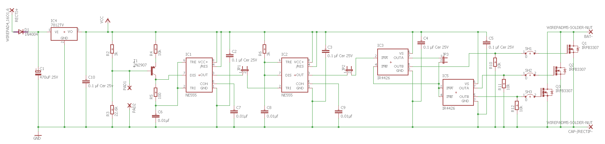
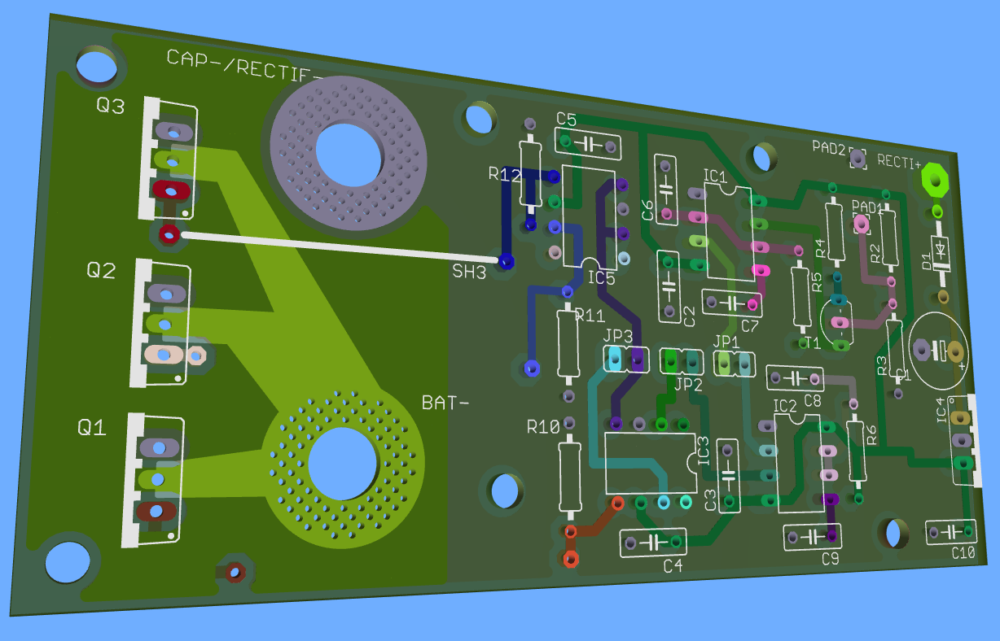

# SDDD

This is a simple direct drive desulfaltor for lead acid battery 12V blocs

You can find schematic, PCB and Gerber files to build a direct drive desulfaltor circuit. This circuit pulses a high current from 30 to 100A at about 2kHz into the battery block to break lead sulfate cristals.

The pulse board drives MOSFET with impulsions from 555 and discharges the capacitor bank into the battery bloc. The capacitor bank is load at 30V DC through a 10W resistor to limit charge current, different values of resistors can be selected to adapt the power of desulfator to the sulfated battery.
Capacitor bank is made with very low ESR electrolytic caps in parallel, the capacity is about 30 mf, in my case:  30 x 1000µf 63V ESR=43mΩ PANASONIC EEUFC1J102U

# SDDD Pulse Board

The main board is the pulse generator board, it drives Mosfets:

Frequency and pulses timming can be calculated as described by Tucsonshooter:

>Pulse width = 1.1 * R6 * C8         (capacitance in farads,  .01 mF = .00000001 farads). 
>Example: 1.1 * 3000*.00000001 = .000033 seconds or 33 microseconds.
>
>Frequency = (R2 * Vcc - .65(R2+R3)) / (.333 * Vcc * R4(R2+R3) * C6)
>In this case Vcc = 12V
>And remember capacitance is in farads. Watch the parentheses (X +Y) 
>
>Example: (3000 * 12 - .65( 3000 + 22500))/ (.333 * 12 * 10000(3000 + 22500) * .00000001 =    (36000-16575) / 10.1898     = 1906 Hertz
>
>The frequency formula looks complicated but it is just adding and multiplying in the right order. If you break the formula down and put >it in Excell it will be much easier.
>
>Thermistors 
>  Remember - a 3K NTC thermistor will read 3K at room temperature (25 deg. C.). It will read about 1.5K at 45 deg.C.

A 3k NTC could be used for R2 to reduce frequency from 2kHz at 24° to 250Hz at 45°, this reduce the average power in the MOSFET and protects it from overheat on good batteries with low internal resistances. This slows frequency when the sulfated battery recovers its capacity and low internal resistance.

This board can be cut in fonction blocs when opening jumpers, this is usefull for testing and try others configurations. An optocoupler connected to Vcc and PAD1 can be use to stop pulses from an MCU or arduino. Stop pulsing can be usefull to control battery voltage or in case of battery overheating. 

# Capacitor bank and power supply

#References

Forum Direct Drive Desulfator Design:

http://leadacidbatterydesulfation.yuku.com/topic/1162/Direct%E2%88%92Drive%E2%88%92Desulfator%E2%88%92Design
http://leadacidbatterydesulfation.yuku.com/topic/1246/Simple-Direct-Drive-Desulfator-PCB-thread
http://www.courtiestown.co.uk/fileuploader/download/download/?d=0&file=custom%2Fupload%2FFile-1368475803.pdf

Evolutions:

http://www.brettcave.net/howto/circuits/Battery_LeadAcidDesulfator-DirectDrive-Type2.pdf
http://www.brettcave.net/howto/circuits/Battery_LeadAcidDesulfator-DirectDrive-Type3.pdf
